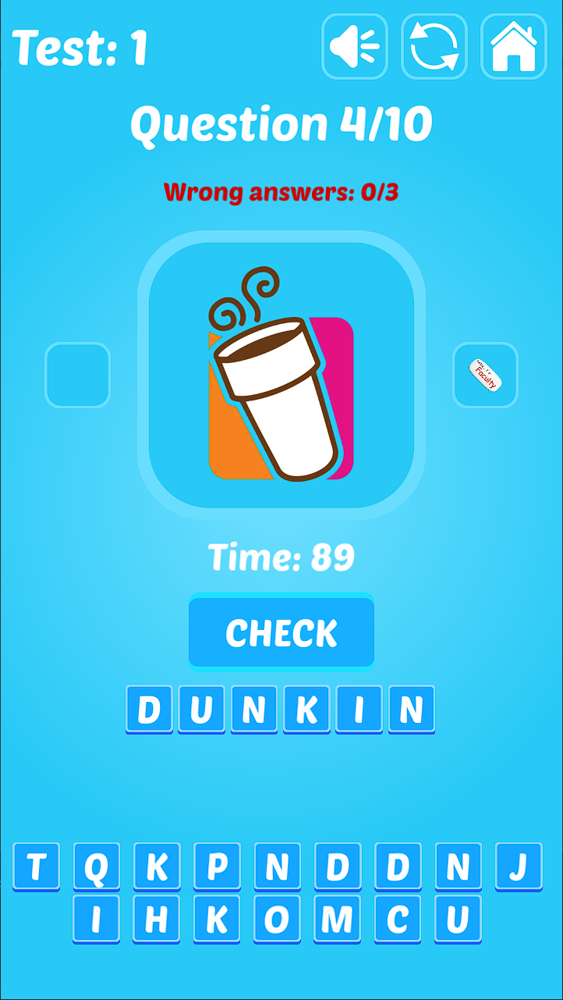
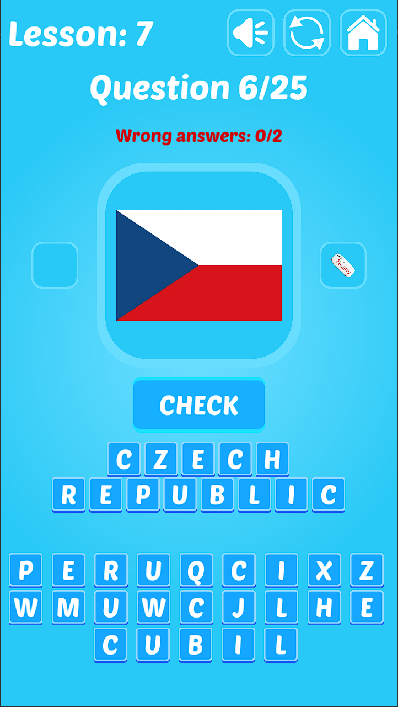
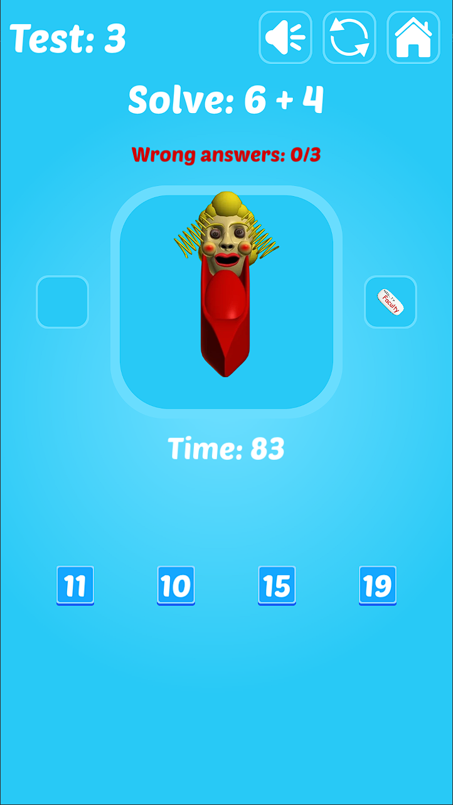

# BBiGLaM-Godot
A remake of my old Baldi game in Godot. This is strictly a mobile game.

### About
-------------
I made this project originally a few months before but in C#. Unbeknownst to me at the time, Godot 4 Mono doesn't support building for Android yet which means I was stuck with this project unless I port it to GDScript. So that's what I did.  
Being a total rewrite, I still kept the original code placement and that is why Game.gd is still very cramped. Maybe I should have just used different scripts for enemies and stuff, whatever. With Godot's editor this isn't too much of a pain to manage.  
It feels really nice to see this game finally working and fully complete, as even the C# version wasn't 100% finished when I stopped development on it. The game has only been tested on Android as I don't have access to Apple's devices and as such, they are unsupported.

### Getting Started
-------------
To compile this project, you will need at least Godot v4.1. Do not forget you will need the required export templates.   
More in-depth guide is avaiable here: https://docs.godotengine.org/en/stable/tutorials/export/exporting_projects.html  
You're free to modify the project as you wish.

### Credits
-------------
I will only list some credits here, as the full list is in the game itself, in the Credits menu.  
Thanks to DipShtick (Varga) testing.  
Graphical and musical assets were made by Basically, Games! (Baldi's Basics Plus)  
UI was made by MadFireOn (Hyper Casual UI)  

### Preview
-------------

